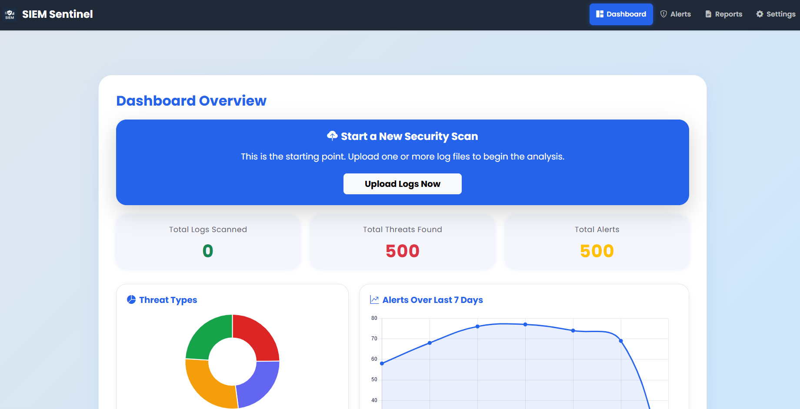
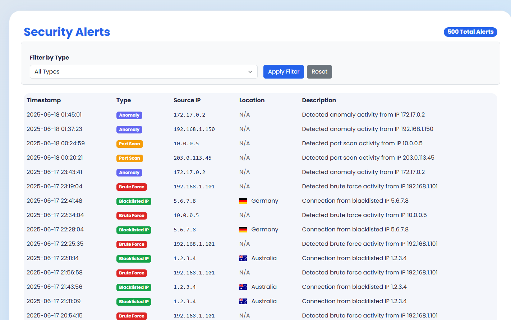
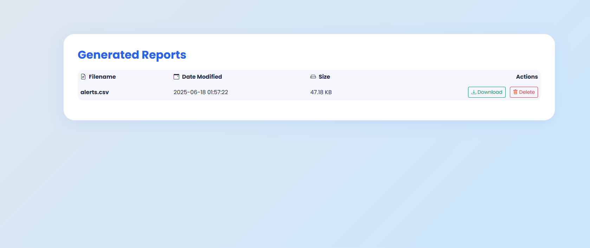
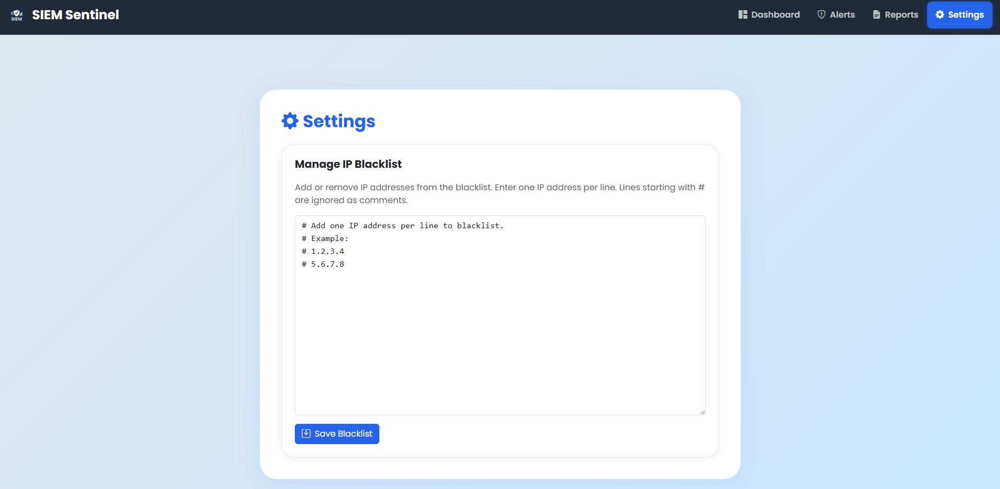

# Sentinel SIEM

**Sentinel SIEM** is a lightweight, web-based Security Information and Event Management (SIEM) tool for rapid log analysis and threat detection. Upload logs, detect attacks and blacklisted IPs, view alerts with geolocation, and manage settings—all from an interactive dashboard.

## Features

- Upload and analyze log files for security threats
- Detect brute-force attacks, port scans, anomalies, and blacklisted IPs
- Interactive dashboard with stats and charts
- Alerts page with IP geolocation and country flags
- Manage IP blacklist from a settings page
- Download and manage generated reports

## Screenshots






## Getting Started

### Prerequisites

- Python 3.8+
- [GeoLite2 Country database](https://dev.maxmind.com/geoip/geolite2-free-geolocation-data) (see below)

### Installation

1. **Clone the repository:**
    ```bash
    git clone https://github.com/yourusername/siem-sentinel.git
    cd siem-sentinel
    ```

2. **Install dependencies:**
    ```bash
    pip install -r requirements.txt
    ```

3. **Download the GeoLite2 Country database:**
    - Register for a free MaxMind account [here](https://www.maxmind.com/en/geolite2/signup)
    - Download the `GeoLite2-Country.mmdb` file
    - Place it in the `database/` directory

4. **Run the application:**
    ```bash
    python project/app.py
    ```

5. **Open your browser and go to:**  
    `http://localhost:5000`

## Project Structure

```
project/
│
├── app.py
├── modules/
│   └── ...analysis modules...
├── templates/
│   └── ...HTML templates...
├── static/
│   └── ...CSS, JS, images...
├── uploads/
├── reports/
├── database/
│   └── GeoLite2-Country.mmdb
├── blacklist.txt
└── requirements.txt
```

## Future Roadmap & Planned Enhancements

Here are some of the features and improvements planned for future versions of SIEM Sentinel:

- Database Integration: Replace the current CSV-based alert system with a robust database like SQLite or PostgreSQL for better performance and scalability.
- Real-Time Threat Intelligence: Integrate with a live threat intelligence API (e.g., AbuseIPDB) to check IPs against up-to-the-minute global blacklists.
- Configurable Detection Rules: Add options in the Settings page to allow users to customize detection thresholds (e.g., number of failed logins for a brute-force alert).
- Live Alerting & Notifications: Implement a system to send real-time alerts via Email or Slack/Discord webhooks when high-severity threats are detected.
- User Authentication: Add a secure login system to restrict access to the dashboard and settings.
- Interactive World Map: Create a map visualization on the dashboard to show the geographic origin of threats.
- Containerization with Docker: Develop a Dockerfile to make the application easy to deploy and run in any environment.

## License

This project is licensed under the MIT License.

---

*For educational and research use. Not intended for production environments.*
