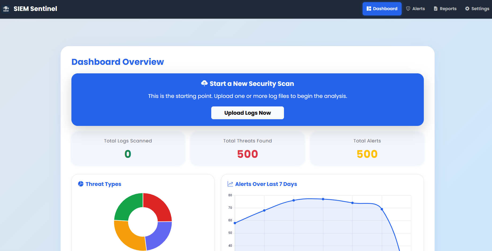
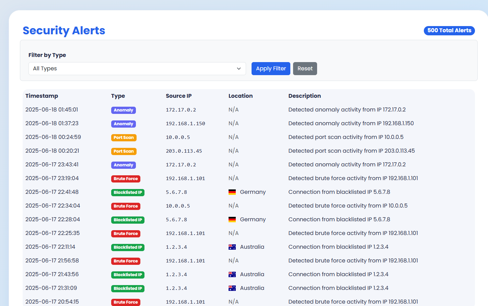
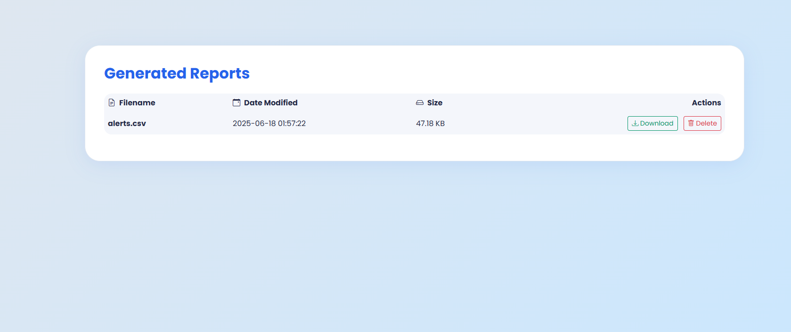
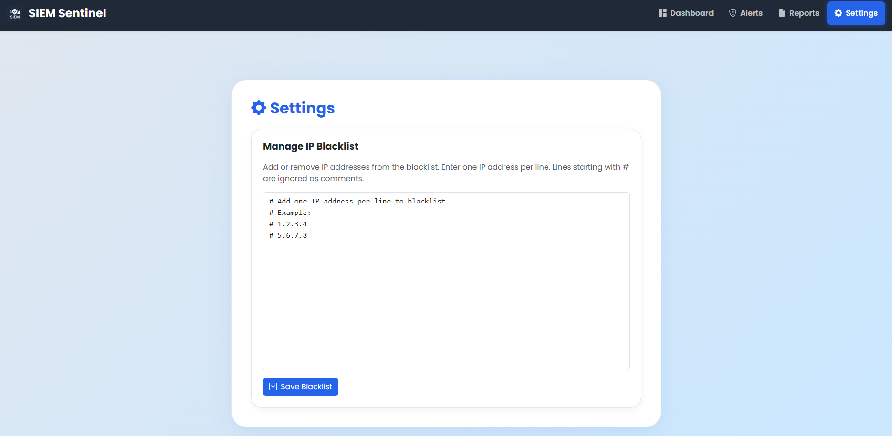

# Sentinel SIEM


**Sentinel SIEM** is a lightweight, web-based Security Information and Event Management (SIEM) tool for rapid log analysis and threat detection. Upload logs, detect attacks and blacklisted IPs, view alerts with geolocation, and manage settings—all from an interactive dashboard.

## Features

- **Log Upload & Analysis** — Upload one or more log files and immediately run all detection modules
- **Brute-Force Detection** — Flags any IP with more than 5 failed login attempts
- **Port Scan Detection** — Flags any IP that accesses more than 10 distinct ports
- **Anomaly Detection** — Identifies rare or unique user-agent strings in traffic
- **Blacklisted IP Detection** — Cross-references every IP against a user-managed blacklist
- **Interactive Dashboard** — Live stats cards, threat-type doughnut chart, and a 7-day alert trend line chart
- **Alerts Page** — Paginated, sortable, and filterable alert list with IP geolocation and country flags
- **Reports Management** — Download or delete per-file CSV reports from the Reports page
- **Settings Page** — Edit the IP blacklist directly in the browser
- **Sample Data Generator** — Built-in script to generate realistic Apache logs and seed the dashboard with demo alerts

## Screenshots

| Dashboard | Alerts |
|-----------|--------|
|  |  |

| Reports | Settings |
|---------|----------|
|  |  |

## Getting Started

### Prerequisites

- Python 3.8+
- [GeoLite2 Country database](https://dev.maxmind.com/geoip/geolite2-free-geolocation-data) (optional — required for IP geolocation)

### Installation

1. **Clone the repository:**
    ```bash
    git clone https://github.com/beast99-p3/Sentinel-SIEM.git
    cd Sentinel-SIEM
    ```

2. **Create and activate a virtual environment (recommended):**
    ```bash
    python -m venv venv
    # Linux / macOS
    source venv/bin/activate
    # Windows
    venv\Scripts\activate
    ```

3. **Install dependencies:**
    ```bash
    pip install -r project/requirements.txt
    ```

4. **(Optional) Enable IP geolocation:**
    - Register for a free MaxMind account [here](https://www.maxmind.com/en/geolite2/signup)
    - Download the `GeoLite2-Country.mmdb` file
    - Place it in the `project/database/` directory

5. **Run the application:**
    ```bash
    cd project
    python app.py
    ```

6. **Open your browser and go to:**  
    `http://localhost:5000`

### Quick Start with Sample Data

To populate the dashboard with realistic demo data without uploading a real log file, run the sample data generator from inside the `project/` directory:

```bash
cd project
python generate_sample_log.py
```

This creates:
- `sample_apache.log` — 10,000 randomized Apache Combined Log Format entries
- `reports/alerts.csv` — 500 pre-generated alerts spanning the last 7 days (used by the dashboard)

After running the script, refresh the dashboard at `http://localhost:5000` to see the charts and stats populated.

## Project Structure

```
Sentinel-SIEM/
│
├── project/
│   ├── app.py                    # Flask application and all routes
│   ├── generate_sample_log.py    # Demo data generator
│   ├── sample_apache.log         # Example Apache log (generated)
│   ├── requirements.txt
│   ├── blacklist.txt             # User-managed IP blacklist
│   │
│   ├── modules/
│   │   ├── log_parser.py         # Parses raw log lines into structured records
│   │   ├── brute_force.py        # Brute-force detection (>5 failed attempts per IP)
│   │   ├── port_scan.py          # Port-scan detection (>10 distinct ports per IP)
│   │   ├── anomaly.py            # Anomaly detection (rare user agents)
│   │   ├── blacklist_ip.py       # Blacklisted IP cross-reference
│   │   └── report_generator.py   # Per-file CSV report writer
│   │
│   ├── templates/                # Jinja2 HTML templates
│   │   ├── base.html
│   │   ├── dashboard.html
│   │   ├── upload.html
│   │   ├── alerts.html
│   │   ├── report.html
│   │   └── settings.html
│   │
│   ├── static/                   # CSS, JavaScript, and images
│   ├── uploads/                  # Uploaded log files (created at runtime)
│   ├── reports/                  # Generated CSV reports (created at runtime)
│   └── database/
│       └── GeoLite2-Country.mmdb # MaxMind GeoIP database (add manually)
│
├── screenshots/                  # README screenshots
├── blacklist.txt
└── README.md
```

## Dependencies

| Package | Purpose |
|---------|---------|
| `Flask` | Web framework |
| `pandas` | Log data processing and CSV I/O |
| `geoip2` | IP geolocation via MaxMind GeoLite2 |
| `numpy` | Numerical support for anomaly detection |
| `requests` | HTTP utilities |
| `python-dotenv` | Environment variable management |
| `elasticsearch` | (Future) Elasticsearch integration |
| `watchdog` | (Future) Real-time log file watching |

Install all dependencies with:
```bash
pip install -r project/requirements.txt
```

## Future Roadmap & Planned Enhancements

- **Database Integration** — Replace the CSV-based alert store with SQLite or PostgreSQL for better performance and scalability
- **Real-Time Threat Intelligence** — Integrate with a live threat intelligence API (e.g., AbuseIPDB) to check IPs against up-to-the-minute global blacklists
- **Configurable Detection Rules** — Allow users to customize detection thresholds (e.g., failed-login count for brute-force alerts) from the Settings page
- **Live Alerting & Notifications** — Send real-time alerts via Email or Slack/Discord webhooks when high-severity threats are detected
- **User Authentication** — Secure login system to restrict access to the dashboard and settings
- **Interactive World Map** — Map visualization on the dashboard showing the geographic origin of threats
- **Containerization with Docker** — Dockerfile to make the application easy to deploy in any environment

## License

This project is licensed under the MIT License.

---

*For educational and research use. Not intended for production environments.*
